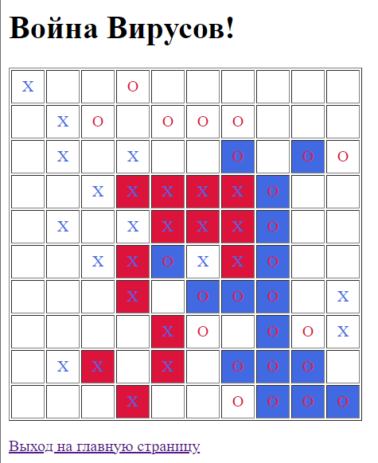

## www_labs

Лабораторные работы по курсу "Технологии сети Интернет"

### Lab1

Вариант 8.\
Страница, содержащая текстовое поле. Скрипт, который при вводе текста в
текстовое поле под текстовым полем отображает список вариантов автозавершения.
Есть заданный в тексте программы массив возможных вариантов,
и показываются те из них, которые начинаются с вводимого текста.
Когда пользователь щёлкает по предложенному варианту,
он меняет содержимое поля на него.

### Lab2

Вариант 11.\
Игра "[Война вирусов](https://ru.wikipedia.org/wiki/Война_вирусов)".

